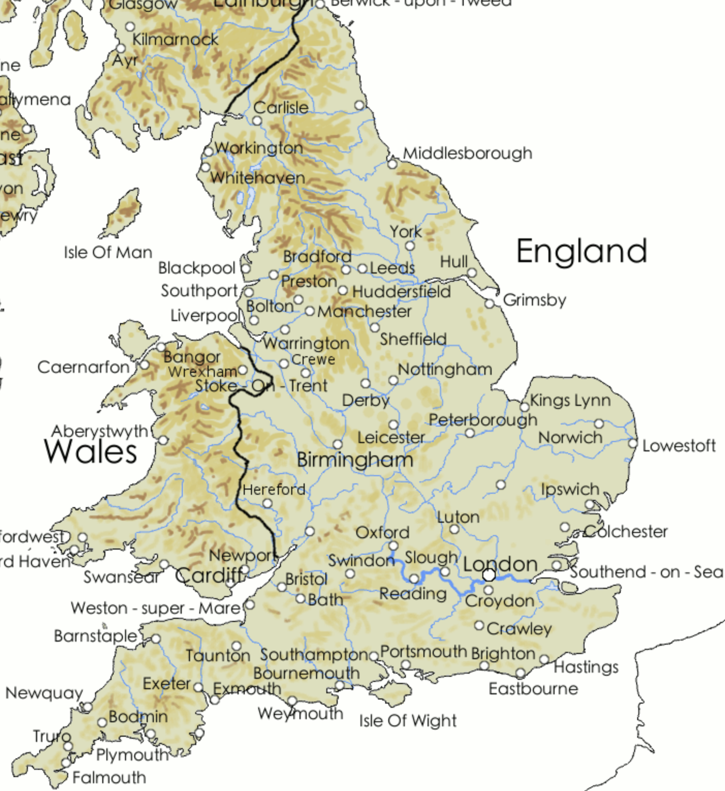

```{r, echo = F}
library(knitr)
opts_chunk$set(tidy.opts = list(width.cutoff = 60), tidy = TRUE)
```
# Problem 1

The ``British_towns`` dataset contains distances between 48 British towns.

```{r}
towns <- read.csv(file = '../Data_csv/British_towns.csv')
towns <- subset(towns, select = -V1)
towns <- as.matrix(towns)
rownames(towns) <- colnames(towns)
```

## a)

Carry out a metric multidimensional scaling.

```{r}
mdsfit <- cmdscale(d = towns, k = 2, eig = T)
y <- mdsfit$points
```

From a plot of the eigenvalues,
does a two-dimensional solution appear reasonable?

```{r}
plot(seq_along(towns[, 1]), mdsfit$eig, type = 'b')
abline(h = 0)
```
Answer: We can see that the first two eigenvalues are somewhat different from zero and the values after that are close to zero. Although half of the eigenvectors are below zero and almost all of those eigenvalues are very large negative values, we can still say that a two-dimensional solution is reasonable because we approximate 3D distances with a 2D solution. Part b of the problem additionally supports this answer.

## b)

Plot the two-dimensional solution (as a 2D scatterplot) labeling each point by town name.

```{r}
plot(y[, 1], y[, 2], type = 'n')
text(y[, 1], y[, 2], labels = rownames(towns), cex = 0.5)
```

Compare with a map of England.
Do they look similar?

```{r, echo=FALSE, fig.cap="Map of british towns", out.height = "30%"}

```

This map is taken from "https://www.britain-visitor.com/images/content_images/british-isles-towns-large.gif".

Answer: While not all towns from our datasets are visible on the map, the towns that are on the map are (relative to each other) in a similar place as they are in the plot, for example London, Bristol, Plymouth, Manchester and Carlisle. So, yes they do look similar.

# Problem 2

Consider the zoo dataset,
where 17 variables are observed on 101 animals.
Excluding the variable ``type``, the other 16 variables are categorical:
most of them are yes/no indicators,
and ``legs`` can be seen as a categorical variable too.
So, the dissimilarity between animals i and j can be defined as the number of characteristics in which they differ:
$\delta_{ij} = \#\{f : x_{ik} \neq x_{jk}\}$.
In ``R`` you can do this as follows:
``D <- matrix(nrow=101, ncol=101)
for (i in 1:101){ for (j in 1:101){ D[i, j] <- sum(x[i,]!=x[j,]) } }``

```{r}
zoo <- read.csv(file = '../Data_csv/zoo.csv')
```

```{r}
D_zoo <- matrix(nrow = 101, ncol = 101)
for (i in 1:101) { for (j in 1:101) { D_zoo[i, j] <- sum(zoo[i,] != zoo[j,]) } }
```

## a)

Carry out a two-dimensional multidimensional scaling.

```{r}
mdsfit <- cmdscale(d = D_zoo, k = 2, eig = T)
y_zoo <- mdsfit$points
```

Plot the resulting configuration using animal names as labels.

```{r}
plot(y_zoo[, 1], y_zoo[, 2], type = 'n')
text(y_zoo[, 1], y_zoo[, 2], labels = zoo$Name, cex = 0.5)
```

## b)

Try to find, if possible, an interpretation for the coordinates, in terms of anatomical or physiological characteristics of the animals.

Answer:
The bottom right cluster mostly contains animals with wings.
The two smaller clusters on the top right contain seas animals.
The middle cluster contains reptiles.
The left cluster contains mammals.

y seems to be variable describing the aquatic level of the animals, high values correspond to aquatic animals, low values correspond to land animals.
x seems to be variable describing the presence of wings, high values correspond to airborne animals and low values to ground animals.

